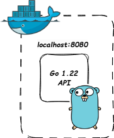

# ExpensesTracker

This is a simple app for tracking expenses. Backend is ready but frontend is in progress. I host this application on my [k8s cluster](https://github.com/ArturMarekNowak/MyK8sCluster). 

## Table of contents
* [General info](#general-info)
* [Technologies](#technologies)
* [Status](#status)
* [Inspiration](#inspiration)

## General info

Project requires existing postgres database with name *ExpensesTracker*. During container start up, migrations are run.
To run the project, simple 

`docker build . -t "expensestracker""`

and

`docker run expensestracker`

should be enough. 

Pic.1 Visualization of project run with docker

Postman collection can be found in `/api` folder with automatic tests collection

## Technologies
* go 1.22
* gin 1.10
* Docker
* Postgres
* Postman

## Status
Project is: _in progress_

## Inspiration
I had it previously in excel